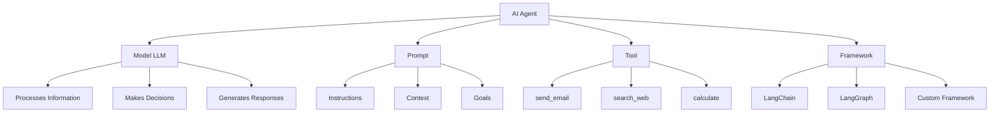
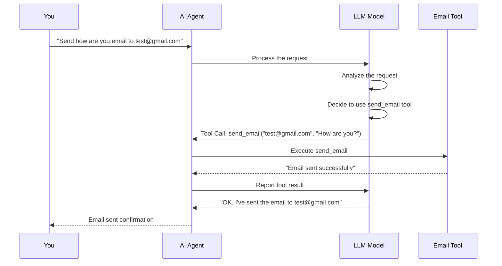
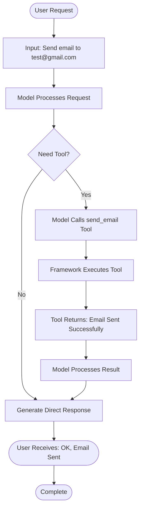

# Gen-AI Developer Classroom Notes - August 26, 2026

## Building a Basic Agent: A Beginner's Guide

### Learning Objectives
By the end of this guide, you will understand:
- What an AI agent is and its core components
- How to build a basic agent that can call tools
- The message flow between the model and tools
- Where to access LLM models for your projects

---

## What is an AI Agent?

An AI Agent is a system that can:
- **Understand** your goals and instructions
- **Make decisions** about what actions to take
- **Use tools** to perform those actions
- **Communicate** results back to you

### Core Components of an Agent



---

## Component 1: Model (LLM) - The Brain

### What is an LLM?
A Large Language Model (LLM) is the "brain" of your agent. It:
- Understands natural language
- Processes information
- Makes decisions about which tools to use
- Generates human-like responses

### Where to Get Access to Models

#### Option 1: Hosted by Provider (Recommended for Beginners)
**Google AI Studio** - Free access available
- Easy to get started
- No infrastructure setup needed
- Good for learning and prototyping

#### Option 2: Hosted by Cloud Providers (Enterprise)
- Google Cloud Vertex AI
- AWS Bedrock
- Azure OpenAI Service
- Better for production applications
- Requires cloud account setup

#### Option 3: Self-Hosted
- Run models on your own hardware
- More control but requires technical expertise
- Higher resource requirements

---

## Component 2: Tools - The Hands

Tools are functions that your agent can call to perform specific actions. Examples:
- **send_email**: Send emails to recipients
- **search_web**: Search the internet for information
- **calculate**: Perform mathematical calculations
- **read_file**: Read files from the filesystem
- **write_file**: Write data to files

---

## Component 3: Framework - The Orchestrator

A framework helps manage the interaction between the model and tools. Popular options:
- **LangChain**: Most popular framework for building LLM applications
- **LangGraph**: For building stateful, multi-actor applications
- **Custom Framework**: Build your own if you have specific needs

---

## Component 4: Prompt - The Instructions

The prompt tells the model:
- What its role is
- What tools are available
- How to behave
- What the goal is

---

## Example Implementation: Email Agent

Let's walk through a real example of building an agent that can send emails.

### The Goal
Build an agent that can send an email when you ask it to.

### Message Flow Diagram



### Step-by-Step Message Exchange

#### Step 1: User Input
**Your Request:**
```
"Send how are you email to test@gmail.com"
```

#### Step 2: Model Processes and Decides
The model analyzes your request and decides it needs to use the `send_email` tool.

**Model's Response (AIMessage):**
```python
AIMessage(
    content=[],  # No text response yet
    additional_kwargs={
        'function_call': {
            'name': 'send_email',
            'arguments': '{"destination": "test@gmail.com", "content": "How are you?"}'
        }
    },
    tool_calls=[{
        'name': 'send_email',
        'args': {
            'destination': 'test@gmail.com',
            'content': 'How are you?'
        },
        'id': 'call_166863',
        'type': 'tool_call'
    }]
)
```

**What happened here?**
- The model understood you want to send an email
- It identified the `send_email` tool as the right tool to use
- It extracted the parameters:
  - `destination`: "test@gmail.com"
  - `content`: "How are you?"
- It returned a tool call instead of a text response

#### Step 3: Framework Executes the Tool
The framework (LangChain/LangGraph) receives the tool call and executes it.

**Tool Execution Result (ToolMessage):**
```python
ToolMessage(
    content='Email sent successfully to test@gmail.com',
    name='send_email',
    id='f365e670-b847-4893-be53-0382b8b5c38c',
    tool_call_id='call_166863'
)
```

**What happened here?**
- The framework called the `send_email` function
- The function sent the actual email
- The function returned a success message
- This result is passed back to the model

#### Step 4: Model Processes the Result
The model receives the tool execution result and formulates a final response.

**Model's Final Response (AIMessage):**
```python
AIMessage(
    content=[{
        'type': 'text',
        'text': "OK. I've sent the email to test@gmail.com."
    }],
    tool_calls=[],  # No more tool calls needed
    response_metadata={
        'finish_reason': 'STOP',
        'model_name': 'gemini-3.1-flash-lite'
    }
)
```

**What happened here?**
- The model saw that the email was sent successfully
- It formulated a natural language response
- It confirmed the action was completed
- No additional tool calls were needed

---

## Complete Agent Workflow



---

## Key Concepts Summary

### 1. Agent Architecture
```
Agent = Model + Prompt + Tools + Framework
```

### 2. Message Types
- **HumanMessage**: Your input to the agent
- **AIMessage**: Model's response (may include tool calls)
- **ToolMessage**: Result from tool execution

### 3. Tool Call Structure
```python
tool_calls = [{
    'name': 'tool_name',      # Which tool to use
    'args': {                  # Parameters for the tool
        'param1': 'value1',
        'param2': 'value2'
    },
    'id': 'unique_id',         # Track the specific call
    'type': 'tool_call'
}]
```

### 4. Decision Flow
```
User Input → Model Analysis → Tool Decision → Tool Execution → 
Result Processing → Final Response → User
```

---

## Getting Started Checklist

### Prerequisites
- [ ] Basic Python knowledge
- [ ] Understanding of APIs
- [ ] Google AI Studio account (free)

### Setup Steps
1. **Get API Key**: Sign up for Google AI Studio
2. **Install Framework**: `pip install langchain langchain-google-genai`
3. **Define Tools**: Create your tool functions
4. **Create Agent**: Initialize with model and tools
5. **Test**: Run your agent with sample requests

---

## Common Tool Examples

### Email Tool
```python
def send_email(destination: str, content: str) -> str:
    """Send an email to the specified destination."""
    # Your email sending logic here
    return f"Email sent successfully to {destination}"
```

### Search Tool
```python
def search_web(query: str) -> str:
    """Search the web for information."""
    # Your web search logic here
    return f"Search results for: {query}"
```

### Calculator Tool
```python
def calculate(expression: str) -> str:
    """Perform mathematical calculations."""
    # Your calculation logic here
    return f"Result: {eval(expression)}"
```

---

## Best Practices for Beginners

### 1. Start Simple
- Begin with one tool at a time
- Test each tool independently
- Gradually add complexity

### 2. Clear Prompts
- Be specific about what you want
- Provide context when needed
- Define the agent's role clearly

### 3. Error Handling
- Always handle tool failures gracefully
- Provide helpful error messages
- Implement retry logic for transient failures

### 4. Testing
- Test with various inputs
- Verify tool outputs
- Monitor token usage

---

## Troubleshooting Common Issues

### Issue: Model doesn't call the tool
**Solution**: 
- Check if the tool is properly registered
- Verify the tool description is clear
- Ensure the prompt mentions tool availability

### Issue: Tool returns wrong parameters
**Solution**:
- Review the tool's parameter definitions
- Check if the model understands the tool's purpose
- Improve the tool's description

### Issue: Agent gets stuck in loops
**Solution**:
- Add maximum iteration limits
- Implement proper stopping conditions
- Review the prompt for clarity

---

## Next Steps

### Advanced Topics to Explore
- Multi-tool agents
- Stateful conversations
- Memory management
- Custom tool development
- Production deployment

### Resources
- Google AI Studio Documentation
- LangChain Documentation
- LangGraph Documentation
- Community forums and tutorials

---

## Summary

Building a basic AI agent involves:
1. **Choosing a Model** (LLM) - Start with Google AI Studio for free access
2. **Defining Tools** - Functions that perform specific actions
3. **Using a Framework** - LangChain or LangGraph to orchestrate
4. **Crafting Prompts** - Clear instructions for the model
5. **Testing** - Verify the agent works as expected

The key insight is that the model acts as a decision-maker, choosing when and how to use tools to accomplish your goals. The framework manages the execution flow, ensuring smooth communication between the model and tools.

---

## Practice Exercise

Try building your own agent:
1. Choose a simple task (e.g., weather lookup, file operations)
2. Define a tool for that task
3. Set up the agent with a model
4. Test it with different requests
5. Observe how the model decides to use your tool

Happy building! 🚀