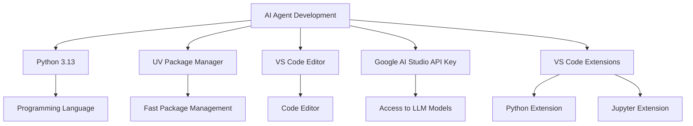
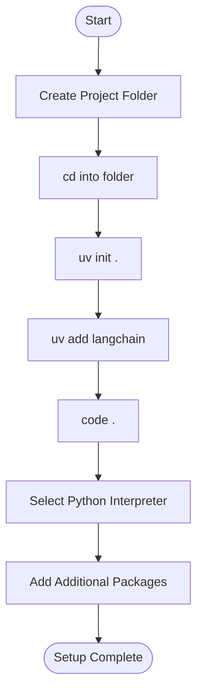
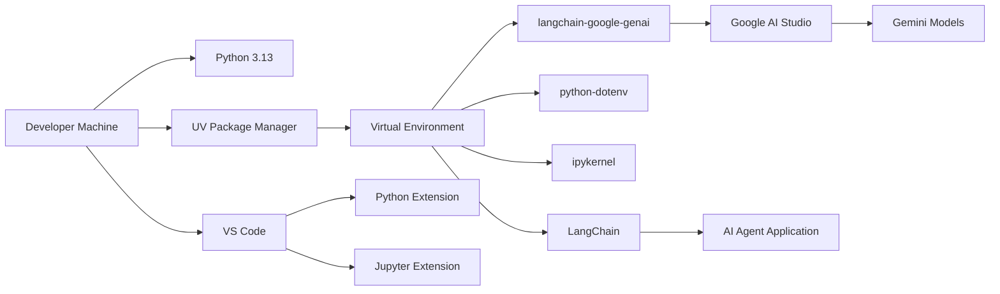

# Gen-AI Developer Classroom Notes - August 27, 2026

## Developer Environment Setup for Building AI Agents

### Learning Objectives
By the end of this guide, you will have:
- A complete development environment for building AI agents
- Python and necessary tools installed
- Visual Studio Code configured for AI development
- A working Python project with LangChain
- Access to Google AI Studio for LLM models

---

## Overview: What You Need to Build AI Agents



---

## Step 1: Install Python

Python is the programming language we'll use to build AI agents.

### Windows Installation
Open Command Prompt or PowerShell and run:
```bash
winget install --id Python.Python.3.13
```

### Mac Installation
Open Terminal and run:
```bash
brew install python@3.13
```

### What is Python?
- Python is a popular programming language
- Version 3.13 is the latest stable release
- It's widely used in AI and machine learning
- Easy to learn and has great library support

---

## Step 2: Install UV (Package Manager)

UV is a fast Python package manager that makes installing libraries quick and easy.

### Windows Installation
```bash
winget install -e --id astral-sh.uv
or
pip install uv
```

### Mac Installation
```bash
brew install uv
```

### What is UV?
- UV is a modern Python package manager
- It's much faster than traditional pip
- It manages project dependencies efficiently
- It helps create isolated Python environments

### Why Use UV Instead of Pip?
- **Speed**: Installs packages 10-100x faster
- **Reliability**: Better dependency resolution
- **Simplicity**: Easier project management
- **Modern**: Built with latest best practices

---

## Step 3: Install Visual Studio Code

VS Code is a powerful code editor that we'll use to write our AI agent code.

### Windows Installation
```bash
winget install Microsoft.VisualStudioCode
```

### Mac Installation
```bash
brew install --cask visual-studio-code
```

### What is VS Code?
- A free, open-source code editor
- Excellent Python support
- Extensible with plugins
- Great for AI development

---

## Step 4: Install VS Code Extensions

Extensions add extra functionality to VS Code.

### Required Extensions
1. **Python (Microsoft)**
   - Provides Python language support
   - Code completion and debugging
   - Integrated terminal

2. **Jupyter (Microsoft)**
   - Support for Jupyter notebooks
   - Interactive code execution
   - Data visualization

### How to Install Extensions
1. Open VS Code
2. Click the Extensions icon (square icon on left sidebar)
3. Search for "Python"
4. Click "Install" on the Microsoft Python extension
5. Search for "Jupyter"
6. Click "Install" on the Microsoft Jupyter extension

---

## Step 5: Get Google AI Studio API Key

You need an API key to access Google's AI models.

### Steps to Get API Key
1. Go to [Google AI Studio](https://aistudio.google.com/)
2. Sign in with your Google account
3. Create a new project or select existing one
4. Navigate to API keys section
5. Generate a new API key
6. Copy and save it securely

### What is Google AI Studio?
- Google's platform for AI model access
- Provides free access to powerful LLMs
- Includes models like Gemini
- Easy integration with LangChain

---

## Step 6: Create Your Python Project

Now let's set up a Python project for building AI agents.

### Project Setup Workflow



### Step-by-Step Commands

#### 1. Create a Project Folder
```bash
mkdir my-ai-agent
cd my-ai-agent
```

#### 2. Initialize the Project with UV
```bash
uv init .
```
**What this does:**
- Creates a new Python project
- Sets up project structure
- Creates `pyproject.toml` file
- Initializes a virtual environment

#### 3. Add LangChain
```bash
uv add langchain
```
**What this does:**
- Installs the LangChain library
- LangChain is a framework for building AI applications
- Adds it to your project dependencies

#### 4. Open VS Code
```bash
code .
```
**What this does:**
- Opens VS Code in your project folder
- Loads your project in the editor

#### 5. Select Python Interpreter
In VS Code:
1. Press `Ctrl+Shift+P` (Windows) or `Cmd+Shift+P` (Mac)
2. Type "Python: Select Interpreter"
3. Choose the Python interpreter created by UV
4. Usually located in `.venv` folder within your project

#### 6. Add Additional Packages
```bash
uv add python-dotenv ipykernel langchain-google-genai
```

**What each package does:**
- **python-dotenv**: Manage environment variables (like API keys)
- **ipykernel**: Run Jupyter notebooks
- **langchain-google-genai**: Connect LangChain to Google AI models

---

## Complete Setup Commands Summary

### Windows (PowerShell/CMD)
```bash
# Install Python
winget install --id Python.Python.3.13

# Install UV
winget install -e --id astral-sh.uv

# Install VS Code
winget install Microsoft.VisualStudioCode

# Create and setup project
mkdir my-ai-agent
cd my-ai-agent
uv init .
uv add langchain
uv add python-dotenv ipykernel langchain-google-genai
code .
```

### Mac (Terminal)
```bash
# Install Python (requires Homebrew)
brew install python@3.13

# Install UV
brew install uv

# Install VS Code
brew install --cask visual-studio-code

# Create and setup project
mkdir my-ai-agent
cd my-ai-agent
uv init .
uv add langchain
uv add python-dotenv ipykernel langchain-google-genai
code .
```

---

## Project Structure After Setup

```
my-ai-agent/
├── .venv/                 # Virtual environment (created by UV)
├── .gitignore            # Git ignore file
├── pyproject.toml        # Project configuration
├── README.md             # Project documentation
└── src/                  # Source code folder
    └── __init__.py       # Python package file
```

---

## Example: First Interaction with Google AI Model

Let's create a simple example to interact with a Google AI model programmatically.

### Step 1: Create Environment File
Create a file named `.env` in your project root:
```env
GOOGLE_API_KEY=your_api_key_here
```

### Step 2: Create a Python Script
Create a file `hello_model.py`:

```python
import os
from dotenv import load_dotenv
from langchain_google_genai import ChatGoogleGenerativeAI

# Load environment variables
load_dotenv()

# Get API key
api_key = os.getenv("GOOGLE_API_KEY")

# Initialize the model
llm = ChatGoogleGenerativeAI(
    model="gemini-3.6-flash",
    api_key=api_key
)

# Send a message to the model
response = llm.invoke("Hello! How are you today?")

# Print the response
print(f"Model response: {response.content}")
```

### Step 3: Run the Script
```bash
uv run python hello_model.py
```

### What This Example Does
1. **Loads environment variables**: Reads your API key from `.env` file
2. **Initializes the model**: Sets up connection to Google's Gemini model
3. **Sends a message**: Asks the model a simple question
4. **Gets response**: Receives and prints the model's answer

---

## Environment Setup Diagram



---

## Verification Checklist

Use this checklist to verify your setup is complete:

### System Requirements
- [ ] Python 3.13 installed
- [ ] UV package manager installed
- [ ] VS Code installed
- [ ] VS Code Python extension installed
- [ ] VS Code Jupyter extension installed

### Project Setup
- [ ] Project folder created
- [ ] UV initialized the project
- [ ] LangChain installed
- [ ] Additional packages installed
- [ ] Python interpreter selected in VS Code

### API Configuration
- [ ] Google AI Studio account created
- [ ] API key generated
- [ ] `.env` file created with API key
- [ ] Example script runs successfully

---

## Common Issues and Solutions

### Issue: UV command not found
**Solution**: 
- Make sure UV is installed correctly
- Restart your terminal/command prompt
- Add UV to your system PATH if needed

### Issue: Python interpreter not found in VS Code
**Solution**:
- Ensure UV created the virtual environment
- Check if `.venv` folder exists in your project
- Manually select the Python executable in `.venv/Scripts/python.exe` (Windows) or `.venv/bin/python` (Mac)

### Issue: API key errors
**Solution**:
- Verify your `.env` file is in the project root
- Check that the API key is correct
- Ensure the environment variable name matches (`GOOGLE_API_KEY`)

### Issue: Package installation fails
**Solution**:
- Ensure you have internet connection
- Try running `uv sync` to resolve dependencies
- Check if UV is up to date: `uv self update`

---

## Next Steps After Setup

### 1. Learn LangChain Basics
- Understand chains and agents
- Explore different model types
- Learn about prompts and templates

### 2. Build Your First Agent
- Create a simple tool-calling agent
- Test with different prompts
- Add more tools as needed

### 3. Explore Jupyter Notebooks
- Create interactive notebooks
- Visualize agent behavior
- Experiment with different models

### 4. Reference Materials
- [LangChain Documentation](https://python.langchain.com/)
- [Google AI Studio Documentation](https://aistudio.google.com/)
- [UV Documentation](https://github.com/astral-sh/uv)

---

## Summary

You now have a complete development environment for building AI agents:

### Installed Components
1. **Python 3.13** - Programming language
2. **UV** - Fast package manager
3. **VS Code** - Code editor with Python/Jupyter support
4. **Google AI Studio API Key** - Access to LLM models

### Project Setup
- Created a Python project using UV
- Installed necessary packages (LangChain, python-dotenv, ipykernel, langchain-google-genai)
- Configured VS Code with the right interpreter
- Ready to build AI agents

### Key Commands to Remember
```bash
uv init .              # Initialize new project
uv add package_name    # Add package
uv run python script.py # Run Python script
code .                 # Open VS Code
```

Your environment is now ready for building sophisticated AI agents! 🚀

---

## Practice Exercise

Try this exercise to verify your setup:

1. Create a new project called `test-agent`
2. Initialize it with UV
3. Add the required packages
4. Create a script that asks the model for a joke
5. Run the script and verify it works

This will confirm that your entire development environment is properly configured and ready for AI agent development.