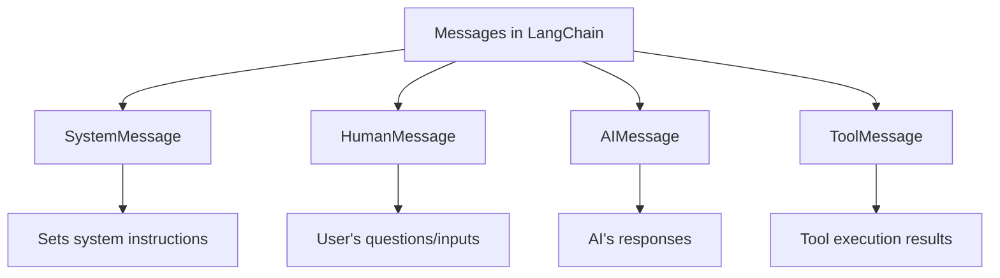
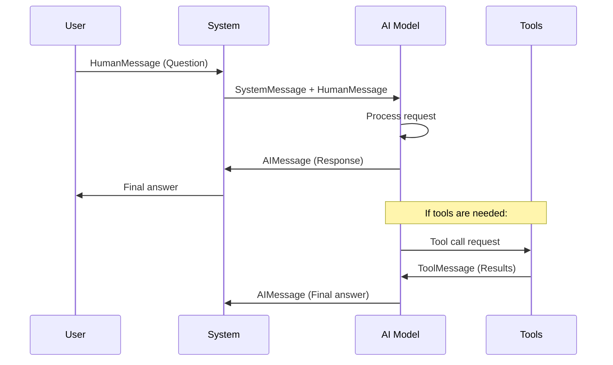
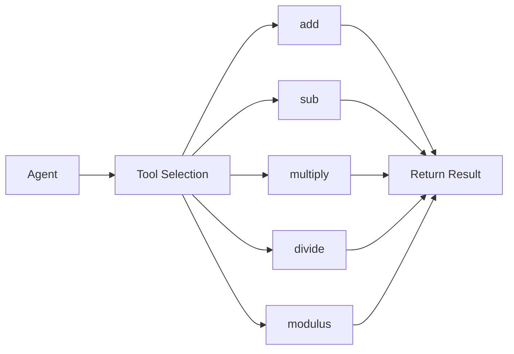
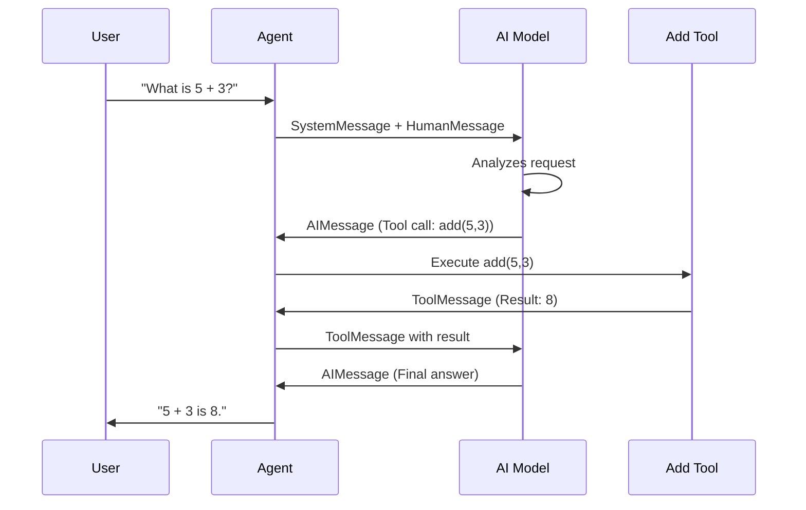
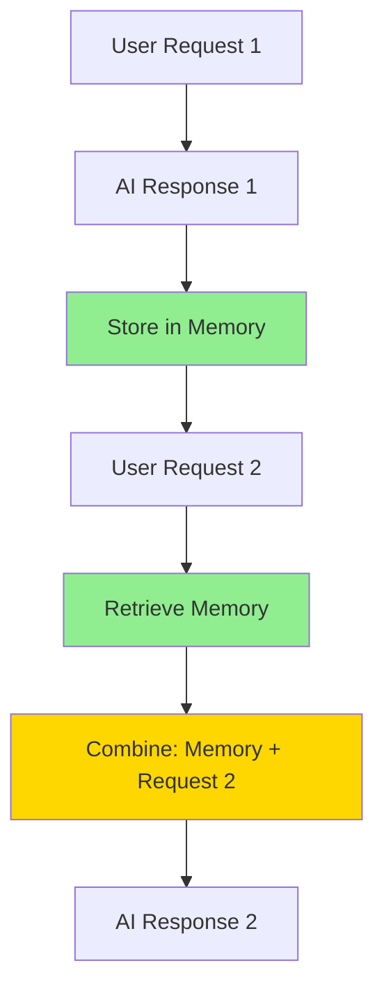
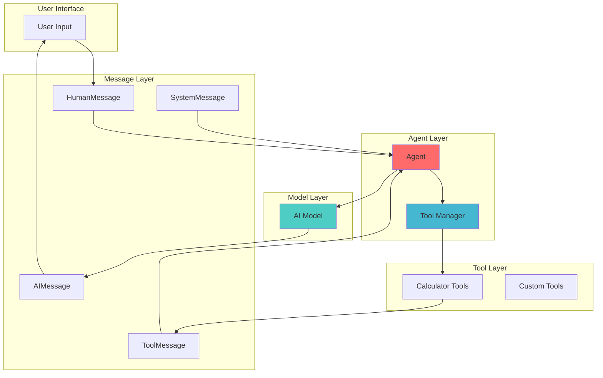

# Day 4: Messages in LangChain - Understanding AI Communication

**Reference Blog**: [Direct AI Blog - Day 4: Messages in LangChain](https://directai.blog/2026/08/31/gen-ai-developer-classroom-notes-31-aug-2026/)

## Learning Objectives
- Understand the different types of messages in LangChain
- Learn how to use SystemMessage, HumanMessage, AIMessage, and ToolMessage
- Implement a practical example with tools and agents
- Understand the importance of memory management in AI agents

---

## 1. Introduction to Messages in LangChain

When we interact with AI models, we communicate through different types of messages. Each message type serves a specific purpose in the conversation flow.

### Message Types Overview



### Message Type Mapping

| Traditional Term | LangChain Class | Purpose |
|------------------|-----------------|---------|
| System Prompt | `SystemMessage` | Sets system instructions for the model |
| Human Prompt | `HumanMessage` | Represents user's question or input |
| LLM Response | `AIMessage` | Response from the AI model |
| Tool Response | `ToolMessage` | Represents results from tool execution |

---

## 2. Understanding the Message Flow

### Basic Communication Flow



---

## 3. Step-by-Step Implementation

### Step 1: Environment Setup

First, we need to set up our environment and load necessary libraries:

```python
# Import packages for loading environment variables
from dotenv import load_dotenv
import os
load_dotenv()
```

**What this does:**
- Loads environment variables from a `.env` file
- Essential for keeping API keys and configuration secure
- `load_dotenv()` returns `True` if successful

### Step 2: Initialize the AI Model

```python
from langchain_google_genai import ChatGoogleGenerativeAI

llm = ChatGoogleGenerativeAI(
    model="gemini-3.1-flash-lite"
)
```

**What this does:**
- Creates an instance of the Google Generative AI model
- Uses the "gemini-3.1-flash-lite" model (a fast, efficient version)
- This model will handle all our AI interactions

### Step 3: Basic Model Invocation

Let's start with a simple question to understand the basic response:

```python
result = llm.invoke("What is capital of France")
result
```

**Expected Output:**
```
AIMessage(content=[{'type': 'text', 'text': 'The capital of France is **Paris**.'}], ...)
```

**Key Points:**
- The model returns an `AIMessage` object
- The content is structured as a list of content blocks
- Each block has a type and the actual text content

### Step 4: Pretty Print the Response

```python
result.pretty_print()
```

**Output:**
```
================================== Ai Message ==================================

[{'type': 'text', 'text': 'The capital of France is **Paris**.'}]
```

**Why use pretty_print():**
- Makes the output more readable
- Shows the message type clearly
- Displays the content structure

---

## 4. Creating Tools for the Agent

Tools allow the AI to perform specific actions like calculations. Let's create mathematical tools:

```python
from langchain.tools import tool

@tool
def add(a, b):
    """Add two numbers.

    Args:
        a: The first number.
        b: The second number.

    Returns:
        The sum of a and b.
    """
    return a + b

@tool
def sub(a, b):
    """Subtract the second number from the first number.

    Args:
        a: The number to subtract from.
        b: The number to subtract.

    Returns:
        The difference between a and b.
    """
    return a - b

@tool
def multiply(a, b):
    """Multiply two numbers.

    Args:
        a: The first number.
        b: The second number.

    Returns:
        The product of a and b.
    """
    return a * b

@tool
def divide(a, b):
    """Divide the first number by the second number.

    Args:
        a: The numerator.
        b: The denominator.

    Returns:
        The quotient of a divided by b.

    Raises:
        ZeroDivisionError: If b is zero.
    """
    return a / b

@tool
def modulus(a, b):
    """Calculate the remainder after dividing a by b.

    Args:
        a: The dividend.
        b: The divisor.

    Returns:
        The remainder of a divided by b.

    Raises:
        ZeroDivisionError: If b is zero.
    """
    return a % b
```

### Tool Architecture



**Key Points about Tools:**
- Each tool is decorated with `@tool`
- Tools have descriptive docstrings that help the AI understand their purpose
- Tools accept specific parameters and return results
- The AI can choose which tool to use based on the user's request

---

## 5. Creating an Agent with Tools

Now let's create an agent that can use these tools:

```python
from langchain.agents import create_agent

agent = create_agent(
    model=llm,
    tools=[add, sub, multiply, divide, modulus],
)
```

**What this does:**
- Creates an agent that can use our mathematical tools
- The agent has access to all five operations
- The agent will automatically decide which tool to use based on the question

---

## 6. Using Messages with the Agent

### Step 1: Create Message Objects

```python
from langchain.messages import AIMessage, HumanMessage, SystemMessage

messages = [
    SystemMessage("You are an helpful assistant"),
    HumanMessage("What is 5 + 3?"),
]
```

**Message Breakdown:**
- `SystemMessage`: Sets the behavior and personality of the AI
- `HumanMessage`: Contains the user's actual question

### Step 2: Invoke the Agent

```python
response = agent.invoke({
    "messages": messages
})
```

### Step 3: Analyze the Response

The response contains a sequence of messages showing the agent's reasoning:

```python
for message in response['messages']:
    print(type(message))
    message.pretty_print()
```

**Expected Output Flow:**
1. `SystemMessage`: "You are an helpful assistant"
2. `HumanMessage`: "What is 5 + 3?"
3. `AIMessage`: Tool call to add function with arguments (5, 3)
4. `ToolMessage`: Result from the add function (8)
5. `AIMessage`: Final answer "5 + 3 is 8."

### Agent Execution Flow



---

## 7. Understanding Memory in AI Models

### The Memory Problem

AI models don't automatically remember previous conversations. Each request is independent unless we explicitly provide the conversation history.

### Demonstration of Memory Issue

#### Without Conversation History:

```python
# First interaction
messages = [
    SystemMessage("You are an helpful assistant"),
    HumanMessage("My name is khaja"),
]
response = llm.invoke(messages)
response.pretty_print()
```

**Output:** "Hello, Khaja! It's nice to meet you..."

```python
# Second interaction - without history
response = llm.invoke([HumanMessage("What is my name?")])
response.pretty_print()
```

**Output:** "I don't know your name. As an AI, I don't have access to your personal identity..."

#### With Conversation History:

```python
# Complete conversation with history
messages = [
    SystemMessage("You are an helpful assistant"),
    HumanMessage("My name is khaja"),
    AIMessage("Hello, Khaja! It's nice to meet you. How are you doing today?"),
    HumanMessage("What is my name?")
]
response = llm.invoke(messages)
response.pretty_print()
```

**Output:** "Your name is Khaja."

### Memory Management Flow



**Key Takeaway:**
- Memory management is the developer's responsibility
- We must maintain and pass conversation history
- Each message in the sequence builds context for the AI

---

## 8. Advanced Example: Detective Book Recommendations

Let's see a more complex example with specific formatting requirements:

```python
messages = [
    SystemMessage("You are an expert in crime and investigations and you are well know detective"),
    HumanMessage("""I'm aspiring to be a detective, 
What books should help in getting started
Give me the output in tabular format
Suggest no more than 5 books
    """)
]
response = llm.invoke(messages)
```

### Extracting Content from Response

```python
# Method 1: Access content directly
response.content

# Method 2: Access content blocks
response.content_blocks

# Method 3: Extract text from content blocks
for block in response.content_blocks:
    if block['type'] == 'text':
        print(block['text'])
```

**Expected Output:** A formatted table with 5 recommended books for aspiring detectives, including titles, authors, and reasons why each book is essential.

---

## 9. Complete Example Implementation

Here's the complete working example combining all concepts:

```python
# Complete implementation
from dotenv import load_dotenv
import os
from langchain_google_genai import ChatGoogleGenerativeAI
from langchain.tools import tool
from langchain.agents import create_agent
from langchain.messages import AIMessage, HumanMessage, SystemMessage

# Step 1: Load environment
load_dotenv()

# Step 2: Initialize model
llm = ChatGoogleGenerativeAI(model="gemini-3.1-flash-lite")

# Step 3: Create tools
@tool
def add(a, b):
    """Add two numbers."""
    return a + b

@tool
def sub(a, b):
    """Subtract two numbers."""
    return a - b

# Step 4: Create agent
agent = create_agent(model=llm, tools=[add, sub])

# Step 5: Create messages
messages = [
    SystemMessage("You are a helpful math assistant"),
    HumanMessage("What is 15 + 7?")
]

# Step 6: Invoke agent
response = agent.invoke({"messages": messages})

# Step 7: Extract final answer
final_answer = response['messages'][-1].content[0]['text']
print(f"Final Answer: {final_answer}")
```

---

## 10. Key Concepts Summary

### Message Types

| Message Type | Use Case | Example |
|--------------|----------|---------|
| `SystemMessage` | Set AI behavior/personality | "You are a helpful assistant" |
| `HumanMessage` | User input/questions | "What is 5 + 3?" |
| `AIMessage` | AI responses | "The answer is 8" |
| `ToolMessage` | Tool execution results | Result from calculator tool |

### Best Practices

1. **Always use SystemMessage** to set clear expectations for AI behavior
2. **Maintain conversation history** for context-aware responses
3. **Use tools** for specific tasks the AI cannot do alone
4. **Handle memory explicitly** - models don't remember automatically
5. **Structure messages properly** in the correct sequence

### Common Pitfalls

- **Not managing memory**: Assuming the AI remembers previous conversations
- **Poor system prompts**: Vague instructions lead to inconsistent responses
- **Missing tool descriptions**: AI won't know how to use tools properly
- **Incorrect message sequence**: Messages must flow in logical order

---

## 11. Architecture Diagram

### Complete System Architecture



---

## 12. Practice Exercises

### Exercise 1: Basic Message Types
Create a conversation with:
- A SystemMessage setting the AI as a travel guide
- A HumanMessage asking about Paris attractions
- Extract and print the response

### Exercise 2: Memory Management
Demonstrate the memory issue by:
- Creating a conversation where you tell the AI your name
- Asking for your name in a separate call without history
- Then asking again with full conversation history

### Exercise 3: Tool Creation
Create a custom tool for:
- Converting temperatures (Celsius to Fahrenheit)
- Integrate it into an agent
- Test with a temperature conversion question

---

## 13. Conclusion

Understanding messages in LangChain is fundamental to building effective AI applications. Key takeaways:

1. **Messages are the building blocks** of AI communication
2. **Each message type has a specific purpose** in the conversation flow
3. **Memory management is crucial** for context-aware interactions
4. **Tools extend AI capabilities** beyond pure language processing
5. **Agents orchestrate the entire process** of message handling and tool usage

The example implementation demonstrates how these concepts work together in a real-world scenario, providing a foundation for building more complex AI applications.

---

## Additional Resources

- [LangChain Documentation](https://python.langchain.com/)
- [Google Generative AI Documentation](https://ai.google.dev/)
- [Complete Example Notebook](https://github.com/GenAIDevelopment/agenticai/blob/main/aug26/basic-agents/hello_llm/model_interaction.ipynb)

---

**Document Created:** Day 4 Study Material  
**Topic:** Messages in LangChain  
**Level:** Beginner-Friendly  
**Focus:** Practical Implementation with Memory Management