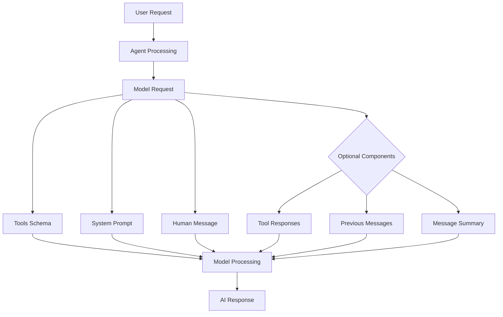
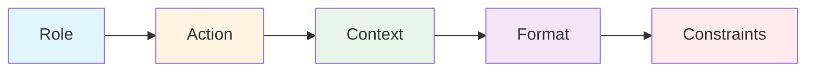
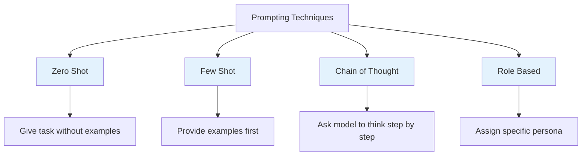
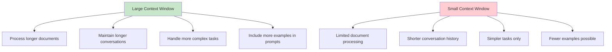
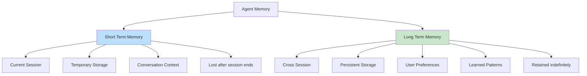
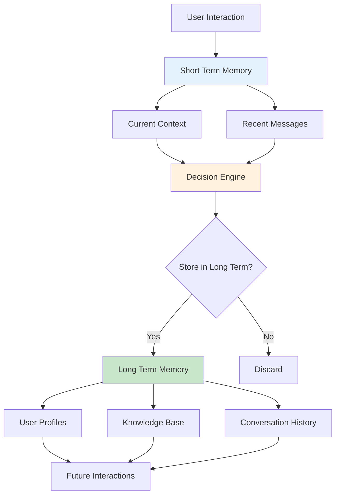
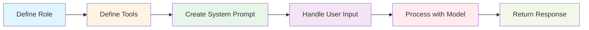
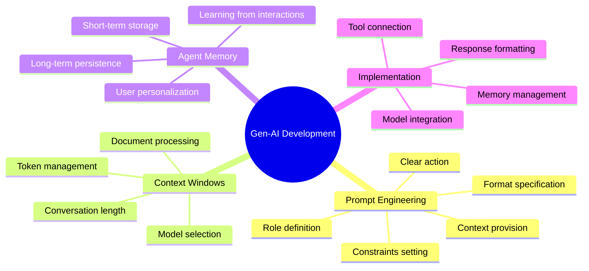

# Gen-AI Developer Classroom Notes - 01/Sep/2026

**Reference Blog**: [Direct AI Blog - Day 5: Prompt Engineering and Memory](https://directai.blog/2026/09/01/gen-ai-developer-classroom-notes-01-sep-2026/)

## Table of Contents
1. [Prompt Engineering](#prompt-engineering)
2. [Context Windows for Models](#context-windows-for-models)
3. [Agents and Memory](#agents-and-memory)
4. [Practical Implementation](#practical-implementation)

---

## Prompt Engineering

### Core Principle: Garbage In, Garbage Out

The quality of output from an AI model depends entirely on the quality of the input (prompt). A well-crafted prompt produces better results.

### What is an Agent?

An agent is a system that combines:
- **Model**: The AI brain (like GPT, Claude, etc.)
- **Tools**: Capabilities the agent can use (search, calculation, database access, etc.)

### How an Agent Processes Requests

Every request to the model carries several components:



### Anatomy of a Good Prompt

A well-structured prompt should include these 5 elements:



1. **Role**: Who should the AI act as?
2. **Action**: What should the AI do?
3. **Context**: Background information for the task
4. **Format**: How should the output be structured?
5. **Constraints**: Limitations or specific requirements

### Sample Prompt Implementation

Here's a practical example following the 5-element structure:

**Prompt:**
```
You are an expert in crime and investigations and you are well know detective
I'm aspiring to be a detective, 
What books should help in getting started
Give me the output in tabular format
Suggest no more than 5 books
```

**Breakdown:**
- **Role**: "expert in crime and investigations and you are well know detective"
- **Action**: "What books should help in getting started"
- **Context**: "I'm aspiring to be a detective"
- **Format**: "Give me the output in tabular format"
- **Constraints**: "Suggest no more than 5 books"

### Popular Prompting Techniques



#### 1. Zero-Shot Prompting
Give the model a task without any examples.

**Example:**
```
Translate this sentence to French: "Hello, how are you?"
```

#### 2. Few-Shot Prompting
Provide examples before asking the model to perform the task.

**Example:**
```
English: "Hello" → French: "Bonjour"
English: "Goodbye" → French: "Au revoir"
English: "Thank you" → French: ?
```

#### 3. Chain of Thought
Ask the model to think through the problem step by step.

**Example:**
```
Solve this step by step: If I have 5 apples and eat 2, then buy 3 more, how many do I have?
```

#### 4. Role-Based Prompting
Assign a specific persona or role to the model.

**Example:**
```
You are a professional math teacher. Explain how to solve quadratic equations to a 10-year-old student.
```

---

## Context Windows for Models

### What is a Context Window?

The context window is the maximum amount of text (in tokens) that a model can process at once. Think of it as the model's "working memory."

### Token vs. Word Conversion

- **1 token** ≈ **0.75 words** (approximately)
- **1 word** ≈ **1.33 tokens** (approximately)

### Model Context Window Comparison

| Provider | Model | Context Window | Approx. Words | Notes |
|----------|-------|----------------|---------------|-------|
| **Meta** | Llama 4 Scout | 10M tokens | ~7.5M words | Extremely long context; multimodal |
| **Google** | Gemini 3.7 Flash | 1M tokens | ~750K words | Long-context multimodal model |
| **Google** | Gemini 3.1 Pro | 1M tokens | ~750K words | Advanced reasoning/multimodal |
| **Google** | Gemini 3.5 Flash | 1M tokens | ~750K words | High-throughput model |
| **Anthropic** | Claude Opus 4.8 | 1M tokens | ~750K words | High-end reasoning/coding/agents |
| **Anthropic** | Claude Sonnet 4.6 | 1M tokens | ~750K words | Faster general-purpose/agentic |
| **OpenAI** | GPT-5 | 400K tokens | ~300K words | 272K input + up to 128K output |
| **OpenAI** | GPT-5.2 | 400K tokens | ~300K words | Professional/reasoning model |
| **Mistral** | Mistral Large 3 | 256K tokens | ~190K words | Open-weight, general-purpose multimodal |
| **Mistral** | Mistral Small 4 | 256K tokens | ~190K words | Efficient hybrid reasoning/coding |
| **Mistral** | Devstral 2 | 256K tokens | ~190K words | Coding/agentic model |
| **Mistral** | Codestral | 128K tokens | ~96K words | Specialized for code |
| **Z.ai** | GLM 5.2 | 1M tokens | ~750K words | Long-context coding/agentic model |

### Context Window Visualization

```mermaid
bar-chart
    title Context Window Comparison (in Millions of Words)
    x-axis [Llama 4, Gemini Models, Claude Models, GPT Models, Mistral Large, Mistral Small, Codestral]
    y-axis "Words (Millions)" 0 --> 8
    Llama 4 [7.5]
    Gemini Models [0.75]
    Claude Models [0.75]
    GPT Models [0.3]
    Mistral Large [0.19]
    Mistral Small [0.19]
    Codestral [0.096]
```

### Why Context Window Matters



---

## Agents and Memory

### Why Agents Need Memory

Agents need memory to:
- Remember previous interactions
- Maintain context across conversations
- Learn from past experiences
- Provide personalized responses

### Types of Memory



#### Short-Term Memory
- **Duration**: Current session only
- **Purpose**: Maintain conversation context
- **Storage**: Temporary (RAM, session variables)
- **Example**: Remembering what you said 5 minutes ago in the same chat

#### Long-Term Memory
- **Duration**: Across multiple sessions
- **Purpose**: Store persistent information
- **Storage**: Databases, vector stores, files
- **Example**: Remembering user preferences from yesterday

### Memory Architecture in Agents



---

## Practical Implementation

### Step-by-Step: Building Your First Agent

Let's implement the detective book recommendation example programmatically.

#### Step 1: Define the Agent Structure



#### Step 2: Implementation Example

Here's a simple Python-like pseudocode implementation:

```python
# Agent Configuration
class DetectiveBookAgent:
    def __init__(self):
        self.role = "expert in crime and investigations and well know detective"
        self.tools = ["book_database", "search_engine"]
        
    def create_system_prompt(self):
        return f"""You are {self.role}.
        You have access to these tools: {self.tools}
        Always provide responses in tabular format.
        Never suggest more than 5 books."""
    
    def process_request(self, user_message):
        # Build the complete prompt
        system_prompt = self.create_system_prompt()
        
        # Send to model with all components
        response = model.generate(
            system_prompt=system_prompt,
            tools_schema=self.get_tools_schema(),
            human_message=user_message
        )
        
        return response

# Usage
agent = DetectiveBookAgent()
user_input = "I'm aspiring to be a detective. What books should help me get started?"
result = agent.process_request(user_input)
print(result)
```

#### Step 3: Expected Output Format

The agent should return a table like this:

| Book Title | Author | Why It's Helpful |
|------------|--------|------------------|
| The Sherlock Holmes Collection | Arthur Conan Doyle | Classic deductive reasoning methods |
| Mindhunter | John Douglas | Understanding criminal psychology |
| The Murder Room | Michael Capuzzo | Real investigation techniques |
| Homicide: A Year on the Killing Streets | David Simon | Real-world detective work |
| Practical Homicide Investigation | Vernon Geberth | Technical investigation procedures |

### Key Takeaways



### Best Practices for Beginners

1. **Start Simple**: Begin with basic prompts before adding complexity
2. **Be Specific**: Clear, detailed prompts produce better results
3. **Test Iteratively**: Try different prompt variations
4. **Use Examples**: Few-shot prompting often improves accuracy
5. **Choose Right Model**: Select models based on your context window needs
6. **Implement Memory**: Start with short-term, add long-term as needed
7. **Format Output**: Specify exactly how you want the response

### Common Mistakes to Avoid

- ❌ Vague or ambiguous prompts
- ❌ Ignoring context window limitations
- ❌ Not specifying output format
- ❌ Forgetting to set constraints
- ❌ Overcomplicating initial implementations
- ❌ Not testing with different models

---

## Summary

This guide covered the fundamentals of Gen-AI development:

1. **Prompt Engineering**: The art of crafting effective prompts using role, action, context, format, and constraints
2. **Context Windows**: Understanding model limitations and choosing the right model for your needs
3. **Agent Memory**: Implementing short-term and long-term memory for better agent performance
4. **Practical Implementation**: Building a simple agent with the detective book recommendation example

Remember: **Garbage In, Garbage Out** - invest time in crafting good prompts for better AI results!

---

## Additional Resources

- **Model Documentation**: Check official docs for the latest context window specifications
- **Prompt Engineering Guides**: Explore advanced techniques as you progress
- **Agent Frameworks**: Look into LangChain, AutoGPT, or similar frameworks for building complex agents

---

*Document created based on Gen-AI Developer Classroom Notes from 01/Sep/2026*
