# Gen-AI Developer Classroom Notes - 02/Sep/2026

## Table of Contents
1. [Using Agents and Chat Models](#using-agents-and-chat-models)
2. [Memory by Scope](#memory-by-scope)
3. [Creating an Agent](#creating-an-agent)
4. [Checkpointer Deep Dive](#checkpointer-deep-dive)
5. [Practical Implementation](#practical-implementation)

---

## Using Agents and Chat Models

### Initializing Chat Models

To work with AI models, you need to create model objects. The simplest way is to use the provider:model format.

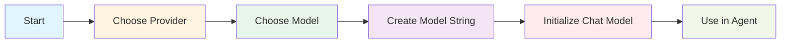

### Model String Format

The format is: `provider:model`

**Examples:**
- `openai:gpt-4`
- `anthropic:claude-3-opus`
- `google:gemini-pro`
- `google_genai:gemini-3.5-flash-lite`
- `meta:llama-3`
- `openrouter:openrouter/free`

### Three Approaches to Create Models

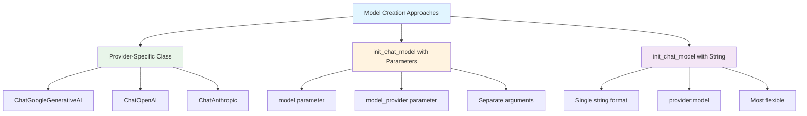

#### Approach 1: Provider-Specific Class
```python
from langchain_google_genai import ChatGoogleGenerativeAI
model = ChatGoogleGenerativeAI(model="gemini-3.5-flash-lite")
```

#### Approach 2: init_chat_model with Parameters
```python
from langchain.chat_models import init_chat_model
model = init_chat_model(
    model="gemini-3.5-flash-lite",
    model_provider="google_genai"
)
```

#### Approach 3: init_chat_model with String (Recommended)
```python
from langchain.chat_models import init_chat_model
model = init_chat_model(model="google_genai:gemini-3.5-flash-lite")
```

**Why Approach 3 is Recommended:**
- Most flexible and concise
- Easy to switch between providers
- Consistent format across all models
- Works directly with `create_agent`

### Two Main Functions

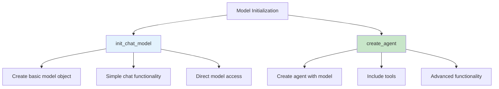

#### 1. init_chat_model
Used for creating a basic model object for simple chat interactions.

#### 2. create_agent
Used for creating a full agent with model, tools, and advanced capabilities.

---

## Memory by Scope

Memory in AI agents is organized by scope - how long the information should be remembered.

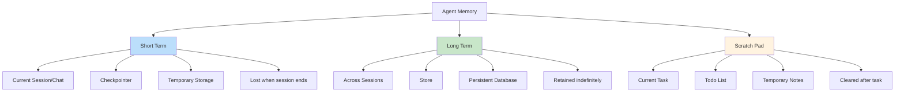

### Memory Scope Comparison

| Scope | Duration | Purpose | Storage Method | Example |
|-------|----------|---------|----------------|---------|
| **Short Term** | Current session only | Maintain conversation context | Checkpointer | Remembering what you said 5 minutes ago |
| **Long Term** | Across sessions | Store persistent information | Store/Database | Remembering user preferences from yesterday |
| **Scratch Pad** | Current task only | Temporary task-specific notes | Todo list | Keeping track of steps in current task |

### Memory Architecture Flow

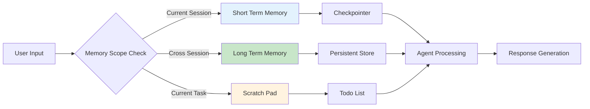

---

## Creating an Agent

### Agent Creation Process

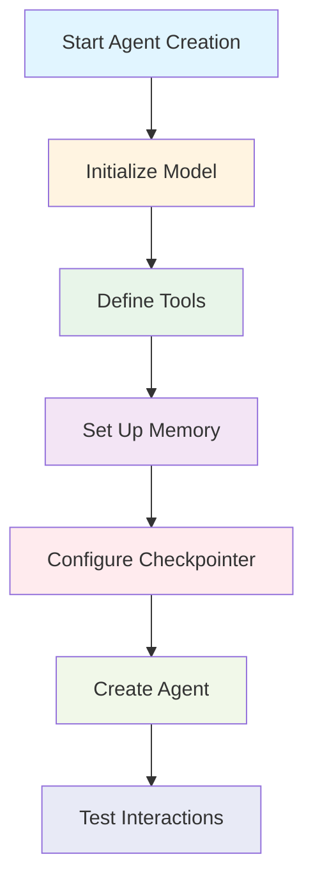

### Agent Interactions

When you create an agent, you can test it with different interactions:

#### Interaction 1: Tell Your Name
```
User: "Tell me your name"
Agent: "I am an AI assistant created to help you with..."
```

#### Interaction 2: Ask Your Name
```
User: "What is my name?"
Agent: "I don't have information about your name yet. Could you tell me?"
```

### Thread and Thread ID

Agent conversations use a unique identifier per session called a "thread."

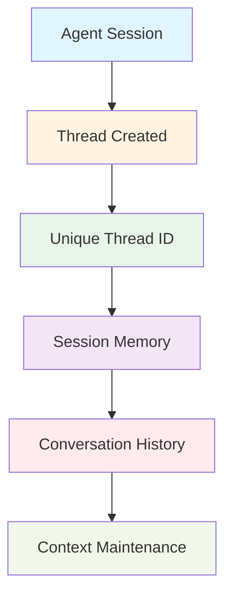

#### Thread ID Configuration

The thread ID is passed in the configuration:

```json
{
  "configurable": {
    "thread_id": "classroom-02sep"
  }
}
```

**Why Thread ID Matters:**
- Each conversation gets a unique ID
- Enables memory isolation between sessions
- Allows multiple concurrent conversations
- Helps in maintaining context per user/session

### Checkpointer for Short-Term Memory

A checkpointer is used to store short-term memory during a session.

```mermaid
flowchart LR
    A[Conversation Start] --> B[Checkpointer Initialized]
    B --> C[Thread ID Assigned]
    C --> D[Messages Stored]
    D --> E[Context Maintained]
    E --> F[Conversation Continues]
    F --> G[Session Ends]
    G --> H[Memory Cleared]
    
    style B fill:#e3f2fd
    style C fill:#c8e6c9
    style D fill:#fff3e0
    style E fill:#f1f8e9
    style H fill:#ffcdd2
```

---

## Checkpointer Deep Dive

### Detailed Checkpointer Explanation

**What is a Checkpointer?**

A checkpointer saves a snapshot of graph state at each step, organized into threads. It enables:
- **Persistence**: Saving state across interactions
- **Human-in-the-loop**: Allowing humans to inspect and approve steps
- **Fault-tolerant execution**: Recovery from failures
- **Conversational memory**: Maintaining context in conversations

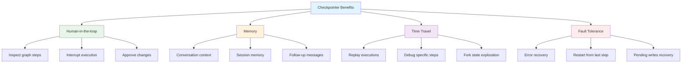

### Core Checkpointer Concepts

#### Threads
A thread is a unique ID assigned to each checkpoint. It contains the accumulated state of a sequence of runs.

**Why Thread ID is Required:**
- Must specify `thread_id` when invoking a graph with a checkpointer
- Used as the primary key for storing and retrieving checkpoints
- Essential for resuming execution after interrupts
- Enables memory isolation between conversations

#### Checkpoints
A checkpoint is a snapshot of the graph state saved at each super-step.

**Super-steps:**
- A super-step is a single "tick" of the graph where all scheduled nodes execute
- Checkpoints are created at super-step boundaries
- Understanding super-steps is important for time travel (can only resume from checkpoints)

#### Checkpoint Example

For a simple graph: `START → A → B → END`

There will be separate super-steps for:
1. Input (empty checkpoint with START as next node)
2. Node A execution (checkpoint with user input and A as next node)
3. Node B execution (checkpoint with A's outputs and B as next node)
4. Final state (checkpoint with B's outputs and no next nodes)

### Getting and Updating State

You can interact with saved graph state using the thread identifier:

```python
# Get the latest state snapshot
config = {"configurable": {"thread_id": "1"}}
graph.get_state(config)

# Get a state snapshot for a specific checkpoint
config = {"configurable": {"thread_id": "1", "checkpoint_id": "specific-id"}}
graph.get_state(config)
```

---

## Practical Implementation

### Step-by-Step: Creating Models and Agents with Provider:Model Format

This example demonstrates the different approaches to create models and agents using the `provider:model` convention.

#### Step 1: Environment Setup

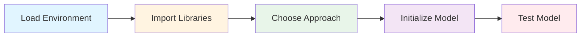

#### Step 2: Implementation Example

```python
# Step 1: Load environment variables
from dotenv import load_dotenv
import os
load_dotenv()

# Step 2: Import required libraries
from langchain.chat_models import init_chat_model
from langchain.agents import create_agent
from langchain.messages import HumanMessage, AIMessage

# Step 3: Different approaches to create models

# Approach 1: Using provider-specific class
from langchain_google_genai import ChatGoogleGenerativeAI
model1 = ChatGoogleGenerativeAI(model="gemini-3.5-flash-lite")

# Approach 2: Using init_chat_model with separate parameters
model2 = init_chat_model(
    model="gemini-3.5-flash-lite",
    model_provider="google_genai"
)

# Approach 3: Using provider:model string format (recommended)
model3 = init_chat_model(model="google_genai:gemini-3.5-flash-lite")

# Step 4: Test the model
response = model3.invoke("What is capital of France?")
print(response)

# Step 5: Create agent using provider:model format
agent = create_agent(
    model="google_genai:gemini-3.5-flash-lite",  # Direct string format
    tools=[]
)

# Step 6: Test the agent
response = agent.invoke({
    "messages": ["What is capital of France"]
})
for message in response['messages']:
    print(message)
```

#### Step 3: Few-Shot Prompting Example

```python
# Example of few-shot prompting with message history
messages = [
    HumanMessage("what is 2 * 2 + 3 ?"),
    AIMessage("""
    step 1: 2 * 2 = 4
    step 2: 4 + 3 = 7

    Answer: 7
    """),
    HumanMessage("What is 3 - 3 + 6 + 4 ?"),
    AIMessage("""
    step 1: 3 - 3 = 0
    step 2: 0 + 6 = 6
    step 3: 6 + 4 = 10

    Answer: 10
    """),
    HumanMessage("what is 5 * 6 - 2 ?")  # Model will follow the pattern
]

response = model3.invoke(messages)
print(response)
```

**Expected Output:**
```
step 1: 5 * 6 = 30
step 2: 30 - 2 = 28

Answer: 28
```

### Memory Scope Implementation

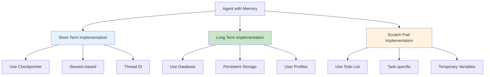

### Complete Memory Architecture Example

```python
# Memory implementation example
class AgentWithMemory:
    def __init__(self):
        # Short-term memory (current session)
        self.checkpointer = MemorySaver()
        self.thread_id = "session-001"
        
        # Long-term memory (across sessions)
        self.long_term_store = {}  # Could be a database
        
        # Scratch pad (current task)
        self.todo_list = []
        
    def create_agent(self):
        config = {
            "configurable": {
                "thread_id": self.thread_id
            }
        }
        
        agent = create_agent(
            model=init_chat_model("openai:gpt-4"),
            tools=[],
            checkpointer=self.checkpointer,
            prompt="You are a helpful assistant with memory."
        )
        
        return agent, config
    
    def add_to_todo(self, task):
        """Add task to scratch pad"""
        self.todo_list.append(task)
    
    def store_long_term(self, key, value):
        """Store information for future sessions"""
        self.long_term_store[key] = value
    
    def get_long_term(self, key):
        """Retrieve information from long-term memory"""
        return self.long_term_store.get(key)
```

### Agent Creation with Memory Implementation

```python
# Complete example with memory and interactions
from langchain.chat_models import init_chat_model
from langchain.agents import create_agent
from langgraph.checkpoint import MemorySaver

# Initialize model with provider:model format
model = init_chat_model("google_genai:gemini-3.5-flash-lite")

# Create checkpointer for short-term memory
checkpointer = MemorySaver()

# Configure thread ID for session management
config = {
    "configurable": {
        "thread_id": "classroom-02sep"
    }
}

# Create agent with memory
agent = create_agent(
    model=model,
    tools=[],
    checkpointer=checkpointer
)

# Test interactions
# Interaction 1: Tell your name
response1 = agent.invoke(
    {"messages": ["Tell me your name"]},
    config=config
)
print("Response 1:", response1['messages'])

# Interaction 2: Ask your name (testing memory)
response2 = agent.invoke(
    {"messages": ["What is my name?"]},
    config=config
)
print("Response 2:", response2['messages'])
```

---

## Key Concepts Summary

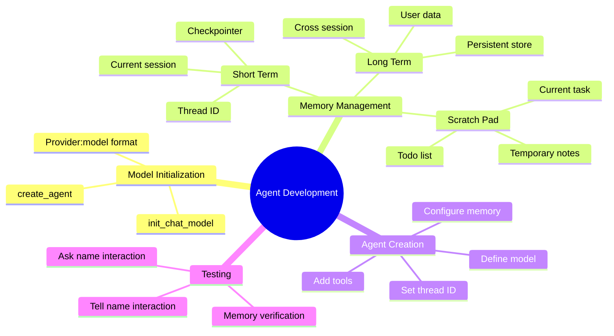

---

## Best Practices for Beginners

1. **Start with Simple Models**: Begin with basic `init_chat_model` before complex agents
2. **Use Thread IDs**: Always assign unique thread IDs for session management
3. **Implement Memory Gradually**: Start with short-term, add long-term as needed
4. **Test Interactions**: Verify agent behavior with simple questions first
5. **Use Checkpointers**: Essential for maintaining conversation context
6. **Plan Memory Scope**: Decide what needs to be remembered vs. temporary
7. **Keep It Simple**: Don't overcomplicate initial implementations

### Common Mistakes to Avoid

- ❌ Not using thread IDs for session management
- ❌ Confusing short-term and long-term memory
- ❌ Forgetting to configure checkpointer
- ❌ Overcomplicating initial agent setup
- ❌ Not testing basic interactions first
- ❌ Ignoring memory scope requirements

---

## Quick Reference

### Model Initialization
```python
model = init_chat_model("provider:model")
```

### Agent Creation
```python
agent = create_agent(model=model, tools=[], checkpointer=checkpointer)
```

### Thread Configuration
```python
config = {"configurable": {"thread_id": "unique-session-id"}}
```

### Memory Types
- **Short-term**: Checkpointer (current session)
- **Long-term**: Store (across sessions)  
- **Scratch pad**: Todo list (current task)

---

## Summary

This guide covered the fundamentals of working with agents and memory:

1. **Model Initialization**: Using `provider:model` format with `init_chat_model` and `create_agent`
2. **Three Model Creation Approaches**: Provider-specific class, init_chat_model with parameters, and the recommended string format
3. **Memory by Scope**: Understanding short-term, long-term, and scratch pad memory
4. **Creating Agents**: Building agents with proper memory configuration and thread management
5. **Checkpointers Deep Dive**: Understanding threads, checkpoints, super-steps, and checkpointer benefits
6. **Practical Implementation**: Step-by-step examples including few-shot prompting and agent interactions

### Key Learnings from "Refer Here" Links

**From LangGraph Checkpointers Documentation:**
- Checkpointers enable human-in-the-loop workflows, memory, time travel, and fault tolerance
- Threads are unique IDs that organize checkpoints by conversation sessions
- Checkpoints are snapshots saved at super-step boundaries
- Thread ID is required for all checkpointer operations
- Super-steps represent single graph execution ticks where multiple nodes can run in parallel

**From Practical Notebook Examples:**
- Multiple approaches to initialize models (provider-specific vs. generic)
- Few-shot prompting using message history with HumanMessage and AIMessage
- Direct string format `provider:model` is the most flexible approach
- Agents can be created with direct model strings without pre-initialization
- Response handling differs between models and agents

Remember: **Memory management and proper model initialization are crucial** for building effective AI agents that can maintain context and provide personalized experiences!

---

## References

This document includes explanations and examples from the following resources:

1. **LangGraph Checkpointers Documentation**
   - https://docs.langchain.com/oss/python/langgraph/checkpointers
   - Detailed explanation of checkpointers, threads, super-steps, and memory management

2. **Practical Implementation Notebook**
   - https://github.com/GenAIDevelopment/agenticai/blob/main/aug26/basic-agents/hello_llm/prompts.ipynb
   - Code examples for model initialization, few-shot prompting, and agent creation

3. **Original Blog Post**
   - https://directai.blog/2026/09/02/gen-ai-developer-classroom-notes-02-sep-2026/
   - Core concepts and classroom notes from 02/Sep/2026

---

*Document created based on Gen-AI Developer Classroom Notes from 02/Sep/2026*
