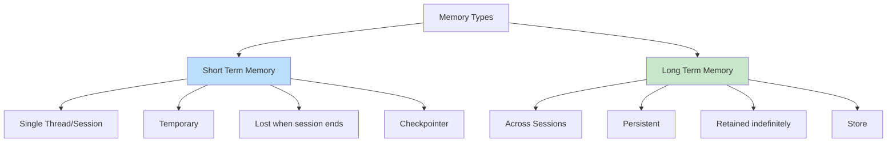
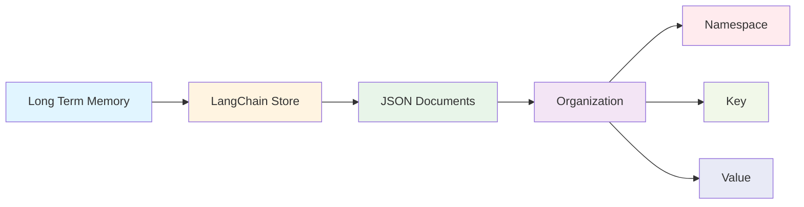
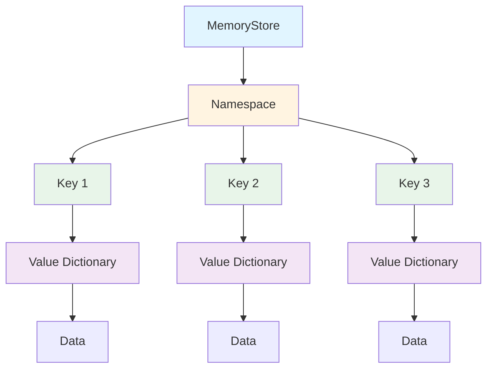
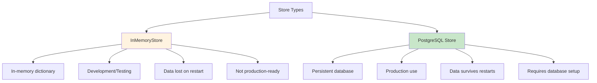
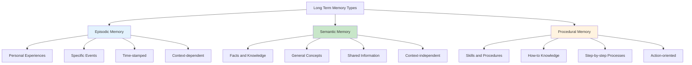
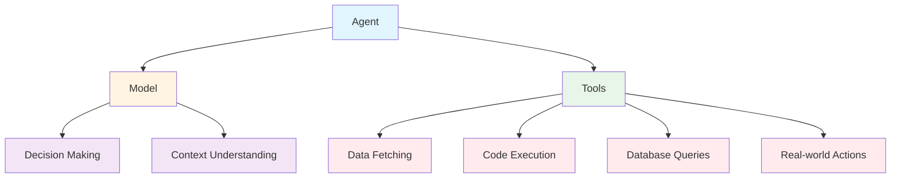
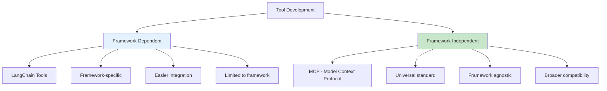
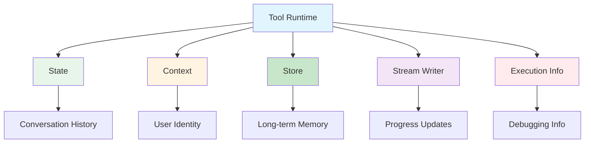
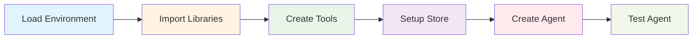
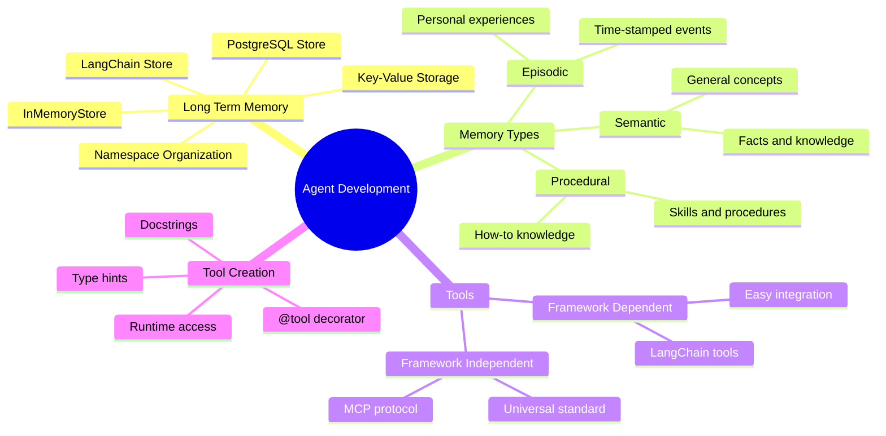

# Gen-AI Developer Classroom Notes - 03/Sep/2026

**Reference Blog**: [Direct AI Blog - Day 7: Long-Term Memory and Tools](https://directai.blog/2026/09/03/gen-ai-developer-classroom-notes-03-sep-2026/)

## Table of Contents
1. [Long-Term Memory](#long-term-memory)
2. [Memory Types](#memory-types)
3. [Tools Overview](#tools-overview)
4. [Building Tools with LangChain](#building-tools-with-langchain)
5. [Practical Implementation](#practical-implementation)

---

## Long-Term Memory

### What is Long-Term Memory?

Long-term memory lets your agent store and recall information across different conversations and sessions. Unlike short-term memory, which is scoped to a single thread, long-term memory persists across threads and can be recalled at any time.



### LangChain Store

LangChain uses **Store** for long-term memory implementation. The store saves data as JSON documents organized by namespace and key.



### MemoryStore Structure

MemoryStore is a Key-Value storage system that is namespaced:

- **Key**: String identifier
- **Value**: Dictionary containing the data
- **Namespace**: Organizational structure (like folders)



### Store Types

#### InMemoryStore
- Saves data to an in-memory dictionary
- Good for development and testing
- Data is lost when the program ends
- **Not recommended for production**

#### PostgreSQL Store
- Persistent database storage
- Data survives program restarts
- Recommended for production use
- Requires database setup



### Namespace and Key Organization

Namespaces help organize information hierarchically, similar to file folders:

```python
# Example namespace structure
namespace = ("user_123", "preferences")
key = "language_settings"
value = {"language": "English", "theme": "dark"}
```

**Common Namespace Patterns:**
- `("users", user_id)` - User-specific data
- `("organizations", org_id)` - Organization data
- `("applications", app_name)` - Application-specific data
- `(user_id, "preferences")` - User preferences

---

## Memory Types

Long-term memory can be categorized into three main types:



### Episodic Memory
- **Definition**: Memory of specific personal experiences and events
- **Examples**: "User asked about pricing last Tuesday", "Customer complained about delay on March 15th"
- **Use Case**: Tracking conversation history, user interactions over time

### Semantic Memory
- **Definition**: General knowledge and facts not tied to specific experiences
- **Examples**: "Python is a programming language", "E=mc² is Einstein's equation"
- **Use Case**: Storing domain knowledge, facts, definitions

### Procedural Memory
- **Definition**: Memory of how to perform tasks and procedures
- **Examples**: "How to process a refund", "Steps to reset password"
- **Use Case**: Storing workflows, standard operating procedures

---

## Tools Overview

### What are Tools?

Tools are actions that agents can perform. They extend what agents can do by letting them:
- Fetch real-time data
- Execute code
- Query external databases
- Take actions in the real world



### Tool Development Approaches



#### Framework Dependent (LangChain)
- Built specifically for LangChain
- Easy integration with LangChain agents
- Uses LangChain-specific decorators and patterns
- Limited to LangChain ecosystem

#### Framework Independent (MCP)
- Model Context Protocol (MCP)
- Universal standard for tools
- Works across different frameworks
- Broader compatibility but more setup required

---

## Building Tools with LangChain

### Basic Tool Structure

A tool in LangChain is a simple Python function with:
1. **Decorator**: `@tool` to mark the function as a tool
2. **Type Hints**: Required for defining input schema
3. **Docstrings**: Informative description for the model

```mermaid
flowchart LR
    A[Tool Function] --> B[@tool Decorator]
    A --> C[Type Hints]
    A --> D[Docstrings]
    
    B --> B1[Marks as tool]
    B --> B2[Enables discovery]
    
    C --> C1[Input schema]
    C --> C2[Type validation]
    
    D --> D1[Tool description]
    D --> D2[Usage guidance]
    
    style A fill:#e1f5ff
    style B fill:#fff4e1
    style C fill:#e8f5e9
    style D fill:#f3e5f5
```

### Tool Creation Example

```python
from langchain.tools import tool

@tool
def add(a: int|float, b: int|float) -> int|float:
    """Adds two numbers

    Args:
        a (int | float): First number
        b (int | float): Second number

    Returns:
        int|float: Sum of two numbers
    """
    return a + b
```

### Tool Components Breakdown

#### 1. Decorator
```python
@tool
```
- Marks the function as a LangChain tool
- Enables automatic tool discovery
- Creates the tool schema

#### 2. Type Hints
```python
a: int|float, b: int|float -> int|float
```
- **Required** for tool schema generation
- Defines input and output types
- Enables type validation
- Helps the model understand expected data types

#### 3. Docstrings
```python
"""Adds two numbers

Args:
    a (int | float): First number
    b (int | float): Second number

Returns:
    int|float: Sum of two numbers
"""
```
- Becomes the tool's description
- Helps the model understand when to use the tool
- Should be informative and concise
- Follow standard Python docstring format

### Customizing Tool Properties

#### Custom Tool Name
```python
@tool("web_search")
def search(query: str) -> str:
    """Search the web for information."""
    return f"Results for: {query}"
```

#### Custom Tool Description
```python
@tool("calculator", description="Performs arithmetic calculations. Use this for any math problems.")
def calc(expression: str) -> str:
    """Evaluate mathematical expressions."""
    return str(eval(expression))
```

### Reserved Parameter Names

The following parameter names are **reserved** and cannot be used in tool functions:

| Parameter Name | Purpose |
|----------------|---------|
| `config` | Reserved for RunnableConfig |
| `runtime` | Reserved for ToolRuntime parameter |

### Tool Runtime Access

Tools can access runtime information through the `ToolRuntime` parameter:

| Component | Description | Use Case |
|-----------|-------------|----------|
| **State** | Short-term memory | Access conversation history |
| **Context** | User/session info | Personalize responses |
| **Store** | Long-term memory | Save user preferences |
| **Stream Writer** | Real-time updates | Show progress |
| **Execution Info** | Thread/run IDs | Debugging and logging |



---

## Practical Implementation

### Step-by-Step: Creating Tools and Agents

Let's implement a complete example with tools and long-term memory.

#### Step 1: Environment Setup



#### Step 2: Implementation Example

```python
# Step 1: Load environment variables
from dotenv import load_dotenv
import os
load_dotenv()

# Step 2: Import required libraries
from langchain.agents import create_agent
from langchain.tools import tool
from langchain.messages import HumanMessage
from langgraph.store.memory import InMemoryStore

# Step 3: Create tools
@tool
def add(a: int|float, b: int|float) -> int|float:
    """Adds two numbers

    Args:
        a (int | float): First number
        b (int | float): Second number

    Returns:
        int|float: Sum of two numbers
    """
    return a + b

@tool
def subtract(a: int|float, b: int|float) -> int|float:
    """Subtracts two numbers

    Args:
        a (int | float): First number
        b (int | float): Second number

    Returns:
        int|float: Difference of two numbers
    """
    return a - b

# Step 4: Setup long-term memory store
store = InMemoryStore()

# Add sample data to store
store.put(
    ("users",),  # Namespace
    "user_123",  # Key
    {            # Value
        "name": "John Smith",
        "language": "English",
        "preferences": {
            "theme": "dark",
            "notifications": True
        }
    }
)

# Step 5: Create agent with tools and store
model_name = "google_genai:gemini-3.5-flash-lite"
agent = create_agent(
    model_name,
    tools=[add, subtract],
    store=store
)

# Step 6: Test the agent
def print_agent_response(response):
    for message in response['messages']:
        print(message)

# Test 1: Simple addition
response1 = agent.invoke({
    "messages": [HumanMessage("what is 2 + 3?")]
})
print("Test 1 - Addition:")
print_agent_response(response1)

# Test 2: Subtraction
response2 = agent.invoke({
    "messages": [HumanMessage("what is 5 - 2?")]
})
print("\nTest 2 - Subtraction:")
print_agent_response(response2)
```

#### Step 3: Expected Output

**Test 1 - Addition:**
```
User: "what is 2 + 3?"
Agent: Uses add tool with a=2, b=3
Tool Result: 5
Final Response: "2 + 3 = 5"
```

**Test 2 - Subtraction:**
```
User: "what is 5 - 2?"
Agent: Uses subtract tool with a=5, b=2
Tool Result: 3
Final Response: "5 - 2 = 3"
```

### Long-Term Memory Implementation

```python
# Complete long-term memory example
from langgraph.store.memory import InMemoryStore

# Create store
store = InMemoryStore()

# Store user preferences
user_id = "user_123"
namespace = ("users", user_id)

# Save data
store.put(
    namespace,
    "preferences",
    {
        "language": "English",
        "theme": "dark",
        "timezone": "UTC"
    }
)

# Retrieve data
user_prefs = store.get(namespace, "preferences")
print("User Preferences:", user_prefs.value)

# Search within namespace
results = store.search(
    namespace,
    filter={"theme": "dark"}
)
print("Search Results:", results)
```

### Tool with Runtime Access

```python
from dataclasses import dataclass
from langchain.tools import ToolRuntime, tool

@dataclass
class Context:
    user_id: str

@tool
def get_user_preferences(runtime: ToolRuntime[Context]) -> str:
    """Get user preferences from long-term memory."""
    # Access the store
    user_id = runtime.context.user_id
    user_prefs = runtime.store.get(("users",), user_id)
    
    if user_prefs:
        return str(user_prefs.value)
    return "No preferences found"

# Create agent with context-aware tool
agent = create_agent(
    model="google_genai:gemini-3.5-flash-lite",
    tools=[get_user_preferences],
    store=store,
    context_schema=Context
)
```

---

## Key Concepts Summary



---

## Best Practices for Beginners

1. **Start with InMemoryStore**: Use InMemoryStore for development, switch to PostgreSQL for production
2. **Use Descriptive Namespaces**: Organize data with clear namespace structures
3. **Write Clear Docstrings**: Help the model understand when to use each tool
4. **Always Use Type Hints**: Required for proper tool schema generation
5. **Test Tools Individually**: Verify each tool works before integrating with agents
6. **Use snake_case Names**: Avoid spaces and special characters in tool names
7. **Plan Memory Structure**: Design your namespace and key organization upfront

### Common Mistakes to Avoid

- ❌ Using reserved parameter names (`config`, `runtime`)
- ❌ Forgetting type hints in tool functions
- ❌ Using InMemoryStore in production
- ❌ Writing unclear or missing docstrings
- ❌ Not organizing namespaces properly
- ❌ Using spaces in tool names
- ❌ Not testing tools before agent integration

---

## Quick Reference

### Long-Term Memory Setup
```python
from langgraph.store.memory import InMemoryStore

store = InMemoryStore()
store.put(namespace, key, value)
data = store.get(namespace, key)
```

### Tool Creation
```python
from langchain.tools import tool

@tool
def my_function(param: type) -> return_type:
    """Tool description."""
    return result
```

### Agent with Tools and Store
```python
from langchain.agents import create_agent

agent = create_agent(
    model="provider:model",
    tools=[tool1, tool2],
    store=store
)
```

### Memory Types
- **Episodic**: Personal experiences and events
- **Semantic**: Facts and general knowledge
- **Procedural**: Skills and procedures

---

## Summary

This guide covered the fundamentals of long-term memory and tools:

1. **Long-Term Memory**: Using LangChain stores for persistent data across sessions
2. **Memory Types**: Understanding episodic, semantic, and procedural memory
3. **Tools Overview**: Framework-dependent vs. independent tool development
4. **Building Tools**: Creating LangChain tools with decorators, type hints, and docstrings
5. **Practical Implementation**: Complete examples with tools, stores, and agents

### Key Learnings from "Refer Here" Links

**From Long-Term Memory Documentation:**
- Long-term memory persists across threads using LangGraph stores
- InMemoryStore for development, PostgreSQL for production
- Namespace and key organization for hierarchical data structure
- Tools can read from and write to the store using runtime.store
- Cross-namespace searching supported through content filters

**From Tools Documentation:**
- Tools are callable functions with well-defined inputs and outputs
- @tool decorator, type hints, and docstrings are required
- Tools can access runtime information (state, context, store)
- Reserved parameter names: `config` and `runtime`
- Custom tool names and descriptions for better model guidance

**From Practical Notebook Examples:**
- Simple add/subtract tools with proper type hints and docstrings
- Agent creation with tools using create_agent function
- Tool invocation and response handling
- Integration of tools with agents for mathematical operations

Remember: **Long-term memory and tools are essential** for building powerful AI agents that can maintain context and perform real-world actions!

---

## References

This document includes explanations and examples from the following resources:

1. **LangChain Long-Term Memory Documentation**
   - https://docs.langchain.com/oss/python/langchain/long-term-memory
   - Detailed explanation of stores, namespaces, and memory implementation

2. **LangChain Tools Documentation**
   - https://docs.langchain.com/oss/python/langchain/tools
   - Comprehensive guide to tool creation, customization, and runtime access

3. **Practical Tools Notebook**
   - https://github.com/GenAIDevelopment/agenticai/blob/main/aug26/basic-agents/hello_llm/tools.ipynb
   - Code examples for tool creation and agent integration

4. **Original Blog Post**
   - https://directai.blog/2026/09/03/gen-ai-developer-classroom-notes-03-sep-2026/
   - Core concepts and classroom notes from 03/Sep/2026

---

*Document created based on Gen-AI Developer Classroom Notes from 03/Sep/2026*
